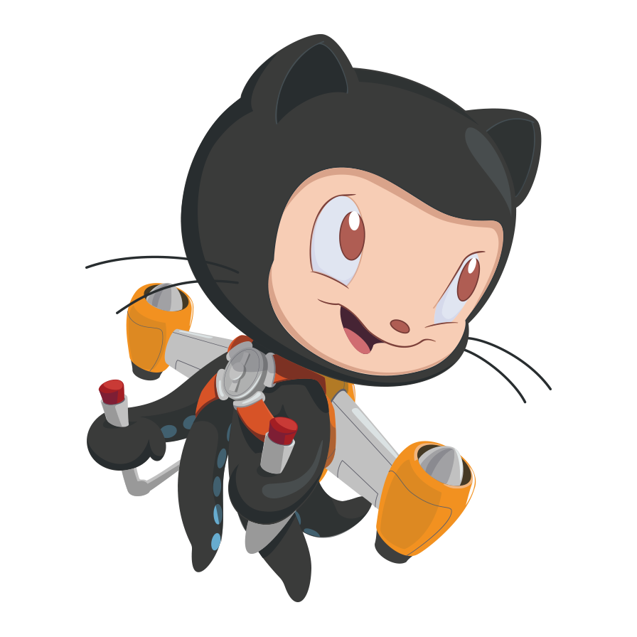

# Hi there, I am Ravindra

I am a dedicated software developer with 5+ years of experience specializing in Java development. I excel in building robust, scalable, and maintainable applications, with a 
strong passion for clean code and efficient design. My expertise extends to backend technologies such as Spring Boot, Hibernate, and RESTful APIs, enabling me to deliver 
comprehensive solutions that meet diverse business needs.

## Skills & Expertise
- Angular
- HTML5
- CSS3
- JavaScript
- TypeScript

### Back-end Development:
- Spring Boot
- Nest.js
- RESTful APIs

### Tools & Technologies:
- Git & GitHub
- Node.js
- npm & Yarn
- Webpack
- Docker

### Database:
- MySQL
- PostgreSQL
- MongoDB

 

- 📚 Competitive Coder
- ⚛️ I ❤️ Full Stack Development
- ⚛️ I ❤️ Java
- 👷🏽‍♂️Looking for Opportunities
- ⚡ Fun fact: ... I love to solve problems. **I can do leetcode problems all day.**

### I'm Currently

  
 
<!--  -->
 
---

Feel free to connect with me on [LinkedIn](https://www.linkedin.com/in/ravindra-sv/) or check out my [portfolio](https://ravindrasiddavatam.github.io/).

